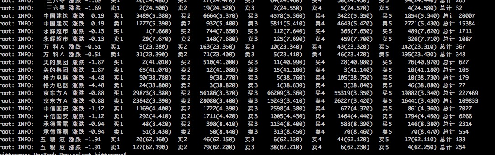
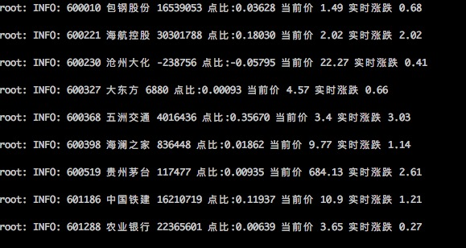
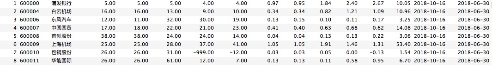

#### stockout 
+ 是一个对上市公司(目前只有A股)各种指标做数据分析的应用程序. 目前包括: 上市公司财务报表抓取、股票基本信息、实时交易数据、历史交易数据、大单数据、根据财报分析PE、EPS等等数据

+ 之前用这些数据跑出来一些公司，然后去仔细读一下财报，会在公众号上更新一些财报的个人分析和见解。欢迎关注公众号：

  

#### 运行环境
+ 最好是 python3.5+, 在笔者mac+python3.7的环境上运行正常

#### 依赖
+ tushare, sqlalchemy, libxml, tornado,scrapy等python library

#### 各目录包含功能简要说明
+ utils 通用函数、工具类等
+ stock
    + crawler 爬数据
    + dd 大单
    + industry 行业、概念等维度
    + institution 机构相关交易
    + realtime 实时数据
    + recommend 计划是通过计算得出的推荐数据
    + report 财务报表分析
    + select 已选
+ server
    + 想法是在这个目录里写http的api层，tornado实现，写了个最简单的demo
    
#### 部分数据截图

​    

#### 后续规划
+ 增加港股、美股的数据
+ http接口完善
+ 增加前端页面，成为一个完整的产品
+ 设计简单的分析模型、打分机制
+ 学习量化分析的知识，尝试引入(有相关经验的人也希望不吝赐教)

#### 代码结构和具体实现质量都比较一般. 希望有朋友可以一起优化

